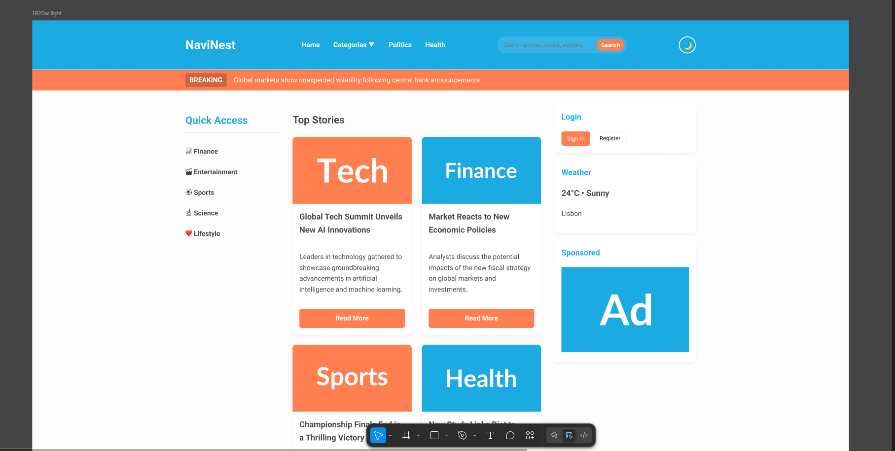
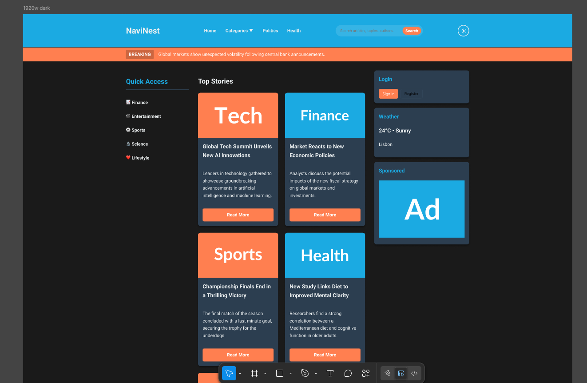

# NaviNest News Hub

Um hub de notícias moderno e responsivo com uma arquitetura limpa e modular.

## Estrutura do Projeto

```
ihc/
├── index.html              Arquivo HTML principal
├── style.css               Estilo principal que importa os estilos dos componentes
├── js/
│   ├── main.js            Ponto de entrada da aplicação
│   └── modules/
│       ├── navigation.js  Função da navegação móvel
│       ├── darkMode.js    Alternância de modo escuro
│       ├── backToTop.js   Botão de voltar ao topo
│       ├── search.js      Função de busca
│       ├── cards.js       Criação de cards e animações
│       ├── tabs.js        Abas e carregamento de conteúdo
│       ├── scroll.js      Controle de rolagem e carregamento infinito
│       └── utils.js       Funções utilitárias
├── css/
│   └── components/
│       ├── variables.css   Variáveis CSS e definições de tema
│       ├── base.css        Estilos básicos
│       ├── header.css      Estilos do cabeçalho e navegação
│       ├── layout.css      Layout e barra lateral
│       ├── tabs.css        Estilos das abas e botão de carregar mais
│       ├── cards.css       Estilos de cards e artigos
│       └── footer.css      Rodapé e botão de voltar ao topo
└── data/
    ├── timelineData.js     Dados de artigos da linha do tempo
    └── favoriteTagsData.js Dados de artigos de tags favoritas
```

## Funcionalidades

* **Arquitetura modular**: Código organizado em módulos para facilitar a manutenção
* **CSS baseado em componentes**: Estilos divididos em arquivos menores para facilitar o controle
* **Modo escuro**: Alternância entre temas claro e escuro com armazenamento persistente
* **Layout responsivo**: Focado em dispositivos móveis com menu tipo hambúrguer para telas pequenas
* **Rolagem infinita**: Carregamento automático de conteúdo conforme a rolagem
* **Navegação por abas**: Três abas, Top Stories, Timeline e Favorite Tags
* **Animações nos cards**: Animações suaves de entrada para os artigos
* **Cálculo de tempo de leitura**: Tempo de leitura gerado de forma automática

## Como Começar

Basta abrir o arquivo `index.html` em um navegador moderno. A aplicação usa módulos ES6, por isso é necessário um servidor local para desenvolvimento, já que o protocolo file:// tem limitações de CORS.

### Usando um Servidor Local

Você pode usar qualquer um destes métodos:

```bash
# Python 3
python -m http.server 8000

# Node.js (com http-server)
npx http-server

# PHP
php -S localhost:8000
```

Depois abra `http://localhost:8000` no navegador.

## Imagens do Design no Figma




## Visão Geral dos Módulos

### Módulos JavaScript

* **main.js**: Inicia todos os módulos quando o DOM está pronto
* **navigation.js**: Controla o menu móvel
* **darkMode.js**: Gerencia a troca de tema e o uso de localStorage
* **backToTop.js**: Mostra e oculta o botão de voltar ao topo e trata sua ação
* **search.js**: Lida com o envio do formulário de busca
* **cards.js**: Cria os cards, controla animações e calcula o tempo de leitura
* **tabs.js**: Gerencia as abas, o carregamento de conteúdo e a função de carregar mais
* **scroll.js**: Controla o carregamento com rolagem infinita
* **utils.js**: Funções utilitárias como cálculo de leitura e formatação de tempo

### Componentes CSS

* **variables.css**: Propriedades personalizadas para temas claro e escuro
* **base.css**: Estilos básicos para o corpo e contêiner
* **header.css**: Cabeçalho, navegação, busca e menu móvel
* **layout.css**: Estrutura principal, barras laterais e widgets
* **tabs.css**: Navegação por abas e botão de carregar mais
* **cards.css**: Grade de cards, artigos e artigos relacionados
* **footer.css**: Rodapé e botão de voltar ao topo

## Suporte dos Navegadores

Requer navegadores modernos com suporte a módulos ES6

* Chrome 61+
* Firefox 60+
* Safari 10.1+
* Edge 16+

## Autor

Desenvolvido por Gerson Leite.
